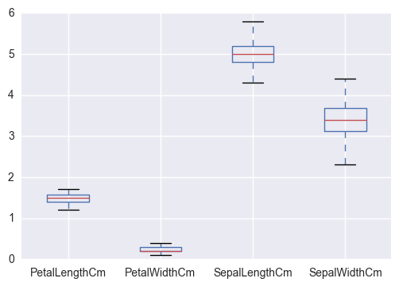
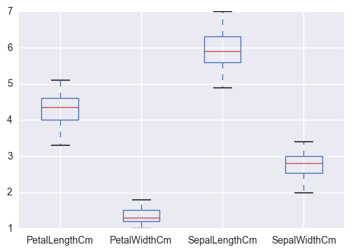
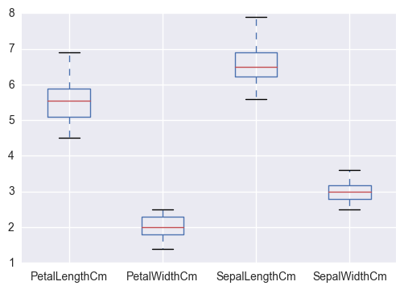
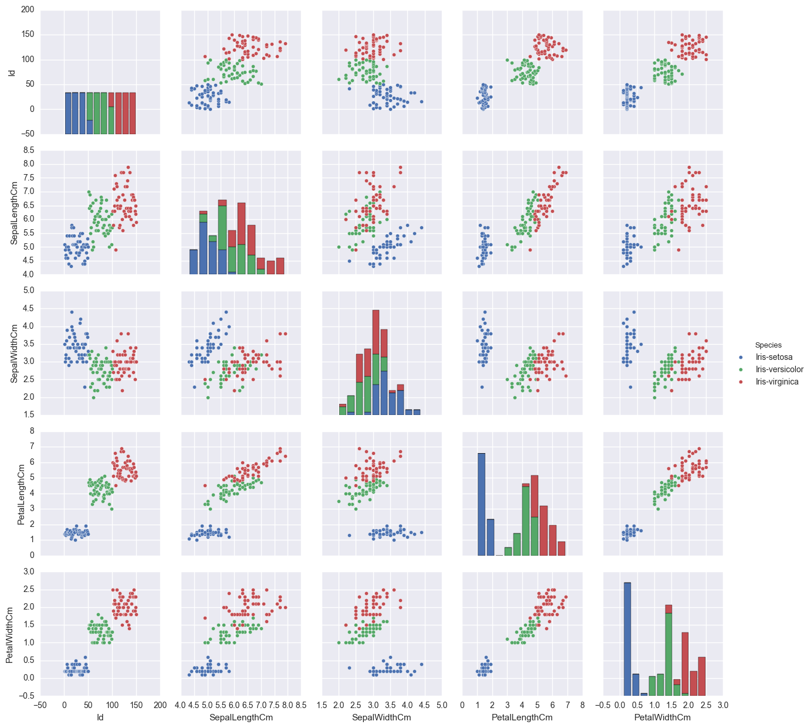

```python
1.	Create a list named my_list in python with the following data points - 
45.4 44.2 36.8 35.1 39.0 60.0 47.4 41.1 45.8 35.6
a.	Print the 5th element in the list

```


```python
my_list = [45.4, 44.2, 36.8, 35.1, 39.0, 60.0, 47.4, 41.1, 45.8, 35.6]
print my_list[5]
```

    60.0
    

b.	Append 55.2 to my_list


```python
my_list.append(55.2)
print my_list
```

    [45.4, 44.2, 36.8, 35.1, 39.0, 60.0, 47.4, 41.1, 45.8, 35.6, 55.2]
    

c.	Remove the 6th element in the list


```python
my_list.pop(6)
print my_list
```

    [45.4, 44.2, 36.8, 35.1, 39.0, 60.0, 41.1, 45.8, 35.6, 55.2]
    

d.	Iterate over the list to print data points greater than 45


```python
sorted(x for x in my_list if x>45)
```


    [45.4, 45.8, 55.2, 60.0]


2.	Introduction to numpy – 
a.	Import the numpy library using the following command – import numpy


```python
import numpy
```

b.	Declare numpy array with the same data points as in my_list using numpy.array()


```python
numpy.array=[45.4, 44.2, 36.8, 35.1, 39.0, 60.0, 47.4, 41.1, 45.8, 35.6]
```

c.	Compute the mean and standard deviation using numpy.mean() and numpy.std() of the above array


```python
numpy.mean(numpy.array)
```


    43.040000000000006


```python
numpy.std(numpy.array)
```


    7.0611897014596625


d.	Use logical referencing to get only those values that are less than 45


```python
sorted(x for x in numpy.array if x<45)
```


    [35.1, 35.6, 36.8, 39.0, 41.1, 44.2]


e.	Compute the max and min of the array using numpy.max() and numpy.min()


```python
numpy.max(numpy.array)
```


    60.0


```python
numpy.min(numpy.array)
```


    35.100000000000001


3.	Introduction to pandas – 
a.	Import the pandas library – import pandas


```python
import pandas
```

b.	Read the IRIS dataset into iris using pandas.read_csv(). 


```python
import os
```


```python
os.getcwd()
```


    'C:\\Users\\rgoyal\\Documents'


```python
#os.listdir('C:\\Users\\rgoyal')
```


```python
iris = pandas.read_csv('C:\\Users\\rgoyal\\iris.csv')
```

c.	Using iris.head(), display the head of the dataset


```python
iris.head()
```


<div>
<table border="1" class="dataframe">
  <thead>
    <tr style="text-align: right;">
      <th></th>
      <th>Id</th>
      <th>SepalLengthCm</th>
      <th>SepalWidthCm</th>
      <th>PetalLengthCm</th>
      <th>PetalWidthCm</th>
      <th>Species</th>
    </tr>
  </thead>
  <tbody>
    <tr>
      <th>0</th>
      <td>1</td>
      <td>5.1</td>
      <td>3.5</td>
      <td>1.4</td>
      <td>0.2</td>
      <td>Iris-setosa</td>
    </tr>
    <tr>
      <th>1</th>
      <td>2</td>
      <td>4.9</td>
      <td>3.0</td>
      <td>1.4</td>
      <td>0.2</td>
      <td>Iris-setosa</td>
    </tr>
    <tr>
      <th>2</th>
      <td>3</td>
      <td>4.7</td>
      <td>3.2</td>
      <td>1.3</td>
      <td>0.2</td>
      <td>Iris-setosa</td>
    </tr>
    <tr>
      <th>3</th>
      <td>4</td>
      <td>4.6</td>
      <td>3.1</td>
      <td>1.5</td>
      <td>0.2</td>
      <td>Iris-setosa</td>
    </tr>
    <tr>
      <th>4</th>
      <td>5</td>
      <td>5.0</td>
      <td>3.6</td>
      <td>1.4</td>
      <td>0.2</td>
      <td>Iris-setosa</td>
    </tr>
  </tbody>
</table>
</div>


d.	Use DataFrame.drop() to drop the id column


```python
df=pandas.DataFrame(iris)
df=df.drop('Id',1)
df.head()
```


<div>
<table border="1" class="dataframe">
  <thead>
    <tr style="text-align: right;">
      <th></th>
      <th>SepalLengthCm</th>
      <th>SepalWidthCm</th>
      <th>PetalLengthCm</th>
      <th>PetalWidthCm</th>
      <th>Species</th>
    </tr>
  </thead>
  <tbody>
    <tr>
      <th>0</th>
      <td>5.1</td>
      <td>3.5</td>
      <td>1.4</td>
      <td>0.2</td>
      <td>Iris-setosa</td>
    </tr>
    <tr>
      <th>1</th>
      <td>4.9</td>
      <td>3.0</td>
      <td>1.4</td>
      <td>0.2</td>
      <td>Iris-setosa</td>
    </tr>
    <tr>
      <th>2</th>
      <td>4.7</td>
      <td>3.2</td>
      <td>1.3</td>
      <td>0.2</td>
      <td>Iris-setosa</td>
    </tr>
    <tr>
      <th>3</th>
      <td>4.6</td>
      <td>3.1</td>
      <td>1.5</td>
      <td>0.2</td>
      <td>Iris-setosa</td>
    </tr>
    <tr>
      <th>4</th>
      <td>5.0</td>
      <td>3.6</td>
      <td>1.4</td>
      <td>0.2</td>
      <td>Iris-setosa</td>
    </tr>
  </tbody>
</table>
</div>


e.	Subset dataframe to create a new data frame that includes only the measurements for the setosa species


```python
dfnew=df.loc[df['Species'] == 'Iris-setosa']
dfnew
```


<div>
<table border="1" class="dataframe">
  <thead>
    <tr style="text-align: right;">
      <th></th>
      <th>SepalLengthCm</th>
      <th>SepalWidthCm</th>
      <th>PetalLengthCm</th>
      <th>PetalWidthCm</th>
      <th>Species</th>
    </tr>
  </thead>
  <tbody>
    <tr>
      <th>0</th>
      <td>5.1</td>
      <td>3.5</td>
      <td>1.4</td>
      <td>0.2</td>
      <td>Iris-setosa</td>
    </tr>
    <tr>
      <th>1</th>
      <td>4.9</td>
      <td>3.0</td>
      <td>1.4</td>
      <td>0.2</td>
      <td>Iris-setosa</td>
    </tr>
    <tr>
      <th>2</th>
      <td>4.7</td>
      <td>3.2</td>
      <td>1.3</td>
      <td>0.2</td>
      <td>Iris-setosa</td>
    </tr>
    <tr>
      <th>3</th>
      <td>4.6</td>
      <td>3.1</td>
      <td>1.5</td>
      <td>0.2</td>
      <td>Iris-setosa</td>
    </tr>
    <tr>
      <th>4</th>
      <td>5.0</td>
      <td>3.6</td>
      <td>1.4</td>
      <td>0.2</td>
      <td>Iris-setosa</td>
    </tr>
    <tr>
      <th>5</th>
      <td>5.4</td>
      <td>3.9</td>
      <td>1.7</td>
      <td>0.4</td>
      <td>Iris-setosa</td>
    </tr>
    <tr>
      <th>6</th>
      <td>4.6</td>
      <td>3.4</td>
      <td>1.4</td>
      <td>0.3</td>
      <td>Iris-setosa</td>
    </tr>
    <tr>
      <th>7</th>
      <td>5.0</td>
      <td>3.4</td>
      <td>1.5</td>
      <td>0.2</td>
      <td>Iris-setosa</td>
    </tr>
    <tr>
      <th>8</th>
      <td>4.4</td>
      <td>2.9</td>
      <td>1.4</td>
      <td>0.2</td>
      <td>Iris-setosa</td>
    </tr>
    <tr>
      <th>9</th>
      <td>4.9</td>
      <td>3.1</td>
      <td>1.5</td>
      <td>0.1</td>
      <td>Iris-setosa</td>
    </tr>
    <tr>
      <th>10</th>
      <td>5.4</td>
      <td>3.7</td>
      <td>1.5</td>
      <td>0.2</td>
      <td>Iris-setosa</td>
    </tr>
    <tr>
      <th>11</th>
      <td>4.8</td>
      <td>3.4</td>
      <td>1.6</td>
      <td>0.2</td>
      <td>Iris-setosa</td>
    </tr>
    <tr>
      <th>12</th>
      <td>4.8</td>
      <td>3.0</td>
      <td>1.4</td>
      <td>0.1</td>
      <td>Iris-setosa</td>
    </tr>
    <tr>
      <th>13</th>
      <td>4.3</td>
      <td>3.0</td>
      <td>1.1</td>
      <td>0.1</td>
      <td>Iris-setosa</td>
    </tr>
    <tr>
      <th>14</th>
      <td>5.8</td>
      <td>4.0</td>
      <td>1.2</td>
      <td>0.2</td>
      <td>Iris-setosa</td>
    </tr>
    <tr>
      <th>15</th>
      <td>5.7</td>
      <td>4.4</td>
      <td>1.5</td>
      <td>0.4</td>
      <td>Iris-setosa</td>
    </tr>
    <tr>
      <th>16</th>
      <td>5.4</td>
      <td>3.9</td>
      <td>1.3</td>
      <td>0.4</td>
      <td>Iris-setosa</td>
    </tr>
    <tr>
      <th>17</th>
      <td>5.1</td>
      <td>3.5</td>
      <td>1.4</td>
      <td>0.3</td>
      <td>Iris-setosa</td>
    </tr>
    <tr>
      <th>18</th>
      <td>5.7</td>
      <td>3.8</td>
      <td>1.7</td>
      <td>0.3</td>
      <td>Iris-setosa</td>
    </tr>
    <tr>
      <th>19</th>
      <td>5.1</td>
      <td>3.8</td>
      <td>1.5</td>
      <td>0.3</td>
      <td>Iris-setosa</td>
    </tr>
    <tr>
      <th>20</th>
      <td>5.4</td>
      <td>3.4</td>
      <td>1.7</td>
      <td>0.2</td>
      <td>Iris-setosa</td>
    </tr>
    <tr>
      <th>21</th>
      <td>5.1</td>
      <td>3.7</td>
      <td>1.5</td>
      <td>0.4</td>
      <td>Iris-setosa</td>
    </tr>
    <tr>
      <th>22</th>
      <td>4.6</td>
      <td>3.6</td>
      <td>1.0</td>
      <td>0.2</td>
      <td>Iris-setosa</td>
    </tr>
    <tr>
      <th>23</th>
      <td>5.1</td>
      <td>3.3</td>
      <td>1.7</td>
      <td>0.5</td>
      <td>Iris-setosa</td>
    </tr>
    <tr>
      <th>24</th>
      <td>4.8</td>
      <td>3.4</td>
      <td>1.9</td>
      <td>0.2</td>
      <td>Iris-setosa</td>
    </tr>
    <tr>
      <th>25</th>
      <td>5.0</td>
      <td>3.0</td>
      <td>1.6</td>
      <td>0.2</td>
      <td>Iris-setosa</td>
    </tr>
    <tr>
      <th>26</th>
      <td>5.0</td>
      <td>3.4</td>
      <td>1.6</td>
      <td>0.4</td>
      <td>Iris-setosa</td>
    </tr>
    <tr>
      <th>27</th>
      <td>5.2</td>
      <td>3.5</td>
      <td>1.5</td>
      <td>0.2</td>
      <td>Iris-setosa</td>
    </tr>
    <tr>
      <th>28</th>
      <td>5.2</td>
      <td>3.4</td>
      <td>1.4</td>
      <td>0.2</td>
      <td>Iris-setosa</td>
    </tr>
    <tr>
      <th>29</th>
      <td>4.7</td>
      <td>3.2</td>
      <td>1.6</td>
      <td>0.2</td>
      <td>Iris-setosa</td>
    </tr>
    <tr>
      <th>30</th>
      <td>4.8</td>
      <td>3.1</td>
      <td>1.6</td>
      <td>0.2</td>
      <td>Iris-setosa</td>
    </tr>
    <tr>
      <th>31</th>
      <td>5.4</td>
      <td>3.4</td>
      <td>1.5</td>
      <td>0.4</td>
      <td>Iris-setosa</td>
    </tr>
    <tr>
      <th>32</th>
      <td>5.2</td>
      <td>4.1</td>
      <td>1.5</td>
      <td>0.1</td>
      <td>Iris-setosa</td>
    </tr>
    <tr>
      <th>33</th>
      <td>5.5</td>
      <td>4.2</td>
      <td>1.4</td>
      <td>0.2</td>
      <td>Iris-setosa</td>
    </tr>
    <tr>
      <th>34</th>
      <td>4.9</td>
      <td>3.1</td>
      <td>1.5</td>
      <td>0.1</td>
      <td>Iris-setosa</td>
    </tr>
    <tr>
      <th>35</th>
      <td>5.0</td>
      <td>3.2</td>
      <td>1.2</td>
      <td>0.2</td>
      <td>Iris-setosa</td>
    </tr>
    <tr>
      <th>36</th>
      <td>5.5</td>
      <td>3.5</td>
      <td>1.3</td>
      <td>0.2</td>
      <td>Iris-setosa</td>
    </tr>
    <tr>
      <th>37</th>
      <td>4.9</td>
      <td>3.1</td>
      <td>1.5</td>
      <td>0.1</td>
      <td>Iris-setosa</td>
    </tr>
    <tr>
      <th>38</th>
      <td>4.4</td>
      <td>3.0</td>
      <td>1.3</td>
      <td>0.2</td>
      <td>Iris-setosa</td>
    </tr>
    <tr>
      <th>39</th>
      <td>5.1</td>
      <td>3.4</td>
      <td>1.5</td>
      <td>0.2</td>
      <td>Iris-setosa</td>
    </tr>
    <tr>
      <th>40</th>
      <td>5.0</td>
      <td>3.5</td>
      <td>1.3</td>
      <td>0.3</td>
      <td>Iris-setosa</td>
    </tr>
    <tr>
      <th>41</th>
      <td>4.5</td>
      <td>2.3</td>
      <td>1.3</td>
      <td>0.3</td>
      <td>Iris-setosa</td>
    </tr>
    <tr>
      <th>42</th>
      <td>4.4</td>
      <td>3.2</td>
      <td>1.3</td>
      <td>0.2</td>
      <td>Iris-setosa</td>
    </tr>
    <tr>
      <th>43</th>
      <td>5.0</td>
      <td>3.5</td>
      <td>1.6</td>
      <td>0.6</td>
      <td>Iris-setosa</td>
    </tr>
    <tr>
      <th>44</th>
      <td>5.1</td>
      <td>3.8</td>
      <td>1.9</td>
      <td>0.4</td>
      <td>Iris-setosa</td>
    </tr>
    <tr>
      <th>45</th>
      <td>4.8</td>
      <td>3.0</td>
      <td>1.4</td>
      <td>0.3</td>
      <td>Iris-setosa</td>
    </tr>
    <tr>
      <th>46</th>
      <td>5.1</td>
      <td>3.8</td>
      <td>1.6</td>
      <td>0.2</td>
      <td>Iris-setosa</td>
    </tr>
    <tr>
      <th>47</th>
      <td>4.6</td>
      <td>3.2</td>
      <td>1.4</td>
      <td>0.2</td>
      <td>Iris-setosa</td>
    </tr>
    <tr>
      <th>48</th>
      <td>5.3</td>
      <td>3.7</td>
      <td>1.5</td>
      <td>0.2</td>
      <td>Iris-setosa</td>
    </tr>
    <tr>
      <th>49</th>
      <td>5.0</td>
      <td>3.3</td>
      <td>1.4</td>
      <td>0.2</td>
      <td>Iris-setosa</td>
    </tr>
  </tbody>
</table>
</div>


f.	Use DataFrame.describe() to get the summary statistics


```python
dfnew.describe()
```


<div>
<table border="1" class="dataframe">
  <thead>
    <tr style="text-align: right;">
      <th></th>
      <th>SepalLengthCm</th>
      <th>SepalWidthCm</th>
      <th>PetalLengthCm</th>
      <th>PetalWidthCm</th>
    </tr>
  </thead>
  <tbody>
    <tr>
      <th>count</th>
      <td>50.00000</td>
      <td>50.000000</td>
      <td>50.000000</td>
      <td>50.00000</td>
    </tr>
    <tr>
      <th>mean</th>
      <td>5.00600</td>
      <td>3.418000</td>
      <td>1.464000</td>
      <td>0.24400</td>
    </tr>
    <tr>
      <th>std</th>
      <td>0.35249</td>
      <td>0.381024</td>
      <td>0.173511</td>
      <td>0.10721</td>
    </tr>
    <tr>
      <th>min</th>
      <td>4.30000</td>
      <td>2.300000</td>
      <td>1.000000</td>
      <td>0.10000</td>
    </tr>
    <tr>
      <th>25%</th>
      <td>4.80000</td>
      <td>3.125000</td>
      <td>1.400000</td>
      <td>0.20000</td>
    </tr>
    <tr>
      <th>50%</th>
      <td>5.00000</td>
      <td>3.400000</td>
      <td>1.500000</td>
      <td>0.20000</td>
    </tr>
    <tr>
      <th>75%</th>
      <td>5.20000</td>
      <td>3.675000</td>
      <td>1.575000</td>
      <td>0.30000</td>
    </tr>
    <tr>
      <th>max</th>
      <td>5.80000</td>
      <td>4.400000</td>
      <td>1.900000</td>
      <td>0.60000</td>
    </tr>
  </tbody>
</table>
</div>


g.	Use DataFrame.groupby() to create grouped data frames by Species and compute summary statistics using DataFrame.describe()


```python
dfgroupby=df.groupby(by='Species')
dfgroupby.describe()
```


<div>
<table border="1" class="dataframe">
  <thead>
    <tr style="text-align: right;">
      <th></th>
      <th></th>
      <th>PetalLengthCm</th>
      <th>PetalWidthCm</th>
      <th>SepalLengthCm</th>
      <th>SepalWidthCm</th>
    </tr>
    <tr>
      <th>Species</th>
      <th></th>
      <th></th>
      <th></th>
      <th></th>
      <th></th>
    </tr>
  </thead>
  <tbody>
    <tr>
      <th rowspan="8" valign="top">Iris-setosa</th>
      <th>count</th>
      <td>50.000000</td>
      <td>50.000000</td>
      <td>50.000000</td>
      <td>50.000000</td>
    </tr>
    <tr>
      <th>mean</th>
      <td>1.464000</td>
      <td>0.244000</td>
      <td>5.006000</td>
      <td>3.418000</td>
    </tr>
    <tr>
      <th>std</th>
      <td>0.173511</td>
      <td>0.107210</td>
      <td>0.352490</td>
      <td>0.381024</td>
    </tr>
    <tr>
      <th>min</th>
      <td>1.000000</td>
      <td>0.100000</td>
      <td>4.300000</td>
      <td>2.300000</td>
    </tr>
    <tr>
      <th>25%</th>
      <td>1.400000</td>
      <td>0.200000</td>
      <td>4.800000</td>
      <td>3.125000</td>
    </tr>
    <tr>
      <th>50%</th>
      <td>1.500000</td>
      <td>0.200000</td>
      <td>5.000000</td>
      <td>3.400000</td>
    </tr>
    <tr>
      <th>75%</th>
      <td>1.575000</td>
      <td>0.300000</td>
      <td>5.200000</td>
      <td>3.675000</td>
    </tr>
    <tr>
      <th>max</th>
      <td>1.900000</td>
      <td>0.600000</td>
      <td>5.800000</td>
      <td>4.400000</td>
    </tr>
    <tr>
      <th rowspan="8" valign="top">Iris-versicolor</th>
      <th>count</th>
      <td>50.000000</td>
      <td>50.000000</td>
      <td>50.000000</td>
      <td>50.000000</td>
    </tr>
    <tr>
      <th>mean</th>
      <td>4.260000</td>
      <td>1.326000</td>
      <td>5.936000</td>
      <td>2.770000</td>
    </tr>
    <tr>
      <th>std</th>
      <td>0.469911</td>
      <td>0.197753</td>
      <td>0.516171</td>
      <td>0.313798</td>
    </tr>
    <tr>
      <th>min</th>
      <td>3.000000</td>
      <td>1.000000</td>
      <td>4.900000</td>
      <td>2.000000</td>
    </tr>
    <tr>
      <th>25%</th>
      <td>4.000000</td>
      <td>1.200000</td>
      <td>5.600000</td>
      <td>2.525000</td>
    </tr>
    <tr>
      <th>50%</th>
      <td>4.350000</td>
      <td>1.300000</td>
      <td>5.900000</td>
      <td>2.800000</td>
    </tr>
    <tr>
      <th>75%</th>
      <td>4.600000</td>
      <td>1.500000</td>
      <td>6.300000</td>
      <td>3.000000</td>
    </tr>
    <tr>
      <th>max</th>
      <td>5.100000</td>
      <td>1.800000</td>
      <td>7.000000</td>
      <td>3.400000</td>
    </tr>
    <tr>
      <th rowspan="8" valign="top">Iris-virginica</th>
      <th>count</th>
      <td>50.000000</td>
      <td>50.000000</td>
      <td>50.000000</td>
      <td>50.000000</td>
    </tr>
    <tr>
      <th>mean</th>
      <td>5.552000</td>
      <td>2.026000</td>
      <td>6.588000</td>
      <td>2.974000</td>
    </tr>
    <tr>
      <th>std</th>
      <td>0.551895</td>
      <td>0.274650</td>
      <td>0.635880</td>
      <td>0.322497</td>
    </tr>
    <tr>
      <th>min</th>
      <td>4.500000</td>
      <td>1.400000</td>
      <td>4.900000</td>
      <td>2.200000</td>
    </tr>
    <tr>
      <th>25%</th>
      <td>5.100000</td>
      <td>1.800000</td>
      <td>6.225000</td>
      <td>2.800000</td>
    </tr>
    <tr>
      <th>50%</th>
      <td>5.550000</td>
      <td>2.000000</td>
      <td>6.500000</td>
      <td>3.000000</td>
    </tr>
    <tr>
      <th>75%</th>
      <td>5.875000</td>
      <td>2.300000</td>
      <td>6.900000</td>
      <td>3.175000</td>
    </tr>
    <tr>
      <th>max</th>
      <td>6.900000</td>
      <td>2.500000</td>
      <td>7.900000</td>
      <td>3.800000</td>
    </tr>
  </tbody>
</table>
</div>


h.	Use DataFrame.boxplot() to plot boxplots by Species


```python
%matplotlib inline
```


```python
import matplotlib.pyplot as plt
```


```python
plt.show()
```


```python
my_plot=dfgroupby.plot(kind='box')
```











Plot a scatter matrix plot using the seaborn library. Use the following to load and plot 


```python
!pip install seaborn
```

    Requirement already satisfied: seaborn in c:\users\rgoyal\appdata\local\continuum\anaconda2\lib\site-packages
    


```python
import seaborn as sns
```


```python
sns.pairplot(iris,hue='Species')
```


    <seaborn.axisgrid.PairGrid at 0x2053e940>





```python

```
